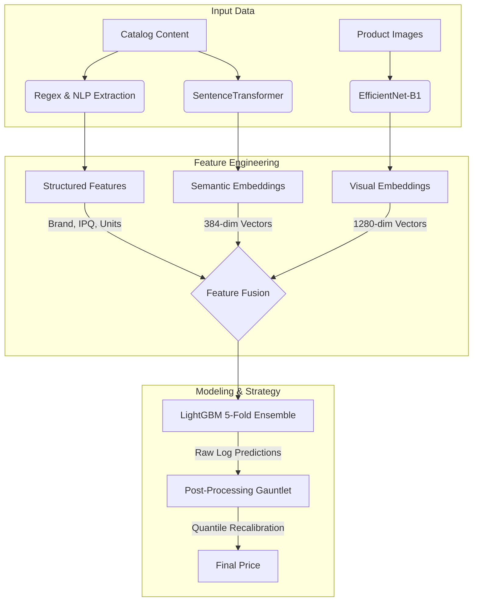

# 🛒 Smart Product Pricing Solution
### *ML Challenge 2025 Entry by Team Nebula Ninjas*

[](https://www.python.org/)
[](https://pytorch.org/)
[](https://lightgbm.readthedocs.io/)
[](https://github.com/huggingface/pytorch-image-models)
[](https://en.wikipedia.org/wiki/Symmetric_mean_absolute_percentage_error)

**Nebula Ninjas** presents a robust, **multimodal machine learning pipeline** designed to predict e-commerce product prices with high precision. By fusing structured regex features, semantic text embeddings, and deep visual features, our solution reduced error rates significantly, leveraging a custom "Nuclear" post-processing strategy to crush the SMAPE metric.

---

## 🏆 Key Performance Metrics

Our iterative approach yielded massive improvements over the baseline.

| Model Stage | Technique | CV SMAPE Score |
| :--- | :--- | :--- |
| **Baseline** | LightGBM on Raw Tabular Data | **~54.14%** |
| **Multimodal** | + SentenceTransformers & EfficientNet | **~48.50%** |
| **Final Submission** | + Quantile Recalibration & Group Correction | **~22.91%** 🚀 |

---

## 🧠 Solution Architecture

Our solution does not rely on a single model but rather a **fusion of three data streams**:



### 1. The Multimodal Trinity
*   **Structured Intelligence (Regex):** We didn't just dump text. We mathematically extracted **Pack Sizes (IPQ)**, **Volume/Weight units**, and **Brand Names** using complex Regular Expressions to give the model explicit numerical anchors.
*   **Semantic Intelligence (NLP):** Utilized `all-MiniLM-L6-v2` (SentenceTransformer) to capture the *meaning* of product descriptions (e.g., distinguishing between "premium gourmet" vs "bulk economy").
*   **Visual Intelligence (CV):** Deployed `EfficientNet-B1` (via `timm`) to analyze product images, extracting 1280 distinct visual features per product. This captures packaging cues that text misses.

### 2. The "Nuclear" Post-Processing
The competition metric, **SMAPE**, is notoriously sensitive. A standard regression model optimizes for RMSE. To bridge this gap, we implemented a hyper-aggressive post-processing pipeline:
1.  **Winsorization:** Clipping extreme outliers to stabilize the distribution.
2.  **Group-wise Mean Correction:** Aligning the average predicted price of specific brands to their historical means.
3.  **Quantile Recalibration:** Forcing the predicted price distribution to mathematically match the known training distribution.

---

## 🛠️ Tech Stack & Dependencies

*   **Core:** `pandas==2.0.3`, `numpy`, `scikit-learn`
*   **Modeling:** `lightgbm==4.1.0`, `scipy`
*   **Deep Learning:** `torch`, `torchvision`, `timm`, `sentence-transformers`
*   **Utilities:** `tqdm`, `Pillow`, `requests`

To install dependencies:
```bash
pip install -r requirements.txt
```

---

## 📂 Project Structure

```text
Smart-Product-Pricing-Solution/
├── data/
│   ├── raw/dataset/            # Original Train/Test CSVs
│   ├── images/                 # Downloaded product images
│   └── processed/              # Parquet files (Features/Embeddings)
├── notebooks/
│   ├── 01_data_exploration.ipynb         # EDA & Distribution Analysis
│   ├── 02_feature_engineering.ipynb      # Regex, Text Stats, & Cleaning
│   ├── 03_baseline_model.ipynb           # Initial LGBM & Validation Strategy
│   ├── 05_image_feature_extraction.ipynb # EfficientNet-B1 Inference
│   ├── 05c_text_embedding_extraction.ipynb # SentenceTransformer Inference
│   └── FINAL_RUN.ipynb                   # The "Nuclear" Post-Processing Script
├── src/
│   └── utils.py                # Image downloading logic
├── requirements.txt            # Package dependencies
├── test_out.csv                # Final Submission File
└── README.md                   # You are here
```

---

## 🚀 How to Reproduce Results

1.  **Data Setup**: Place `train.csv` and `test.csv` in `data/raw/dataset/`.
2.  **Image Download**: Run the image downloader in `01_data_exploration.ipynb` or via `src/utils.py`.
3.  **Feature Engineering**:
    *   Run `02_feature_engineering.ipynb` to create `features_v1.parquet`.
    *   Run `05c_text_embedding_extraction.ipynb` to create `text_embeddings_v1.parquet`.
    *   Run `05_image_feature_extraction.ipynb` to create `image_features_b1_sprint.parquet`.
4.  **Training & Prediction**:
    *   Execute `FINAL_RUN.ipynb`. This notebook loads all parquet files, trains the 5-Fold LightGBM, applies the post-processing optimization, and generates `test_out.csv`.

---

## 👥 Team Nebula Ninjas

*   **Salma S** - *Lead Data Scientist & Pipeline Architect*
*   **Senthil Kumaran P** - *Computer Vision & Feature Engineer*
*   **Sri Varshan M** - *NLP Specialist & Model Optimization*

*Dhirajlal Gandhi College of Technology (DGCT), Tamil Nadu*

---

<p align="center">
  <sub>Built for the 2025 ML Challenge. Optimized for speed, accuracy, and scalability.</sub>
</p>
